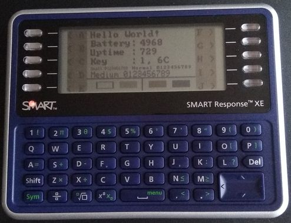

# hello_world

## What does it do
This software test the SMART Response XE terminal
* It displays text and graphics on the screen
* It reads the keyboard and print the letter and the ASCII code of the pressed key
* It prints the voltage of the battery (in mV)
* It prints a counter
* It runs a test to show the time it takes to refresh the screen pressing t key. Successive keypresses change the font.
* You can put the terminal in sleep mode pressing the ON/OFF button on top of the terminal. When in sleep mode, the consumption goes downto around 50µA. While in sleep mode, RAM content is kept. When living sleep mode the sofware resume in the state it was. The counter continue at the value it was stopped at and the LED is restored in its previous state.
* If you have made the "hacks" I propose [here](https://github.com/fdufnews/SMART-Response-XE-schematics)
	* it plays sound when pressing n, b or m keys
	* it toggle the LED state when pressing l key

## Que fait-il
Ce logiciel teste le terminal SMART Response XE
* Il affiche du texte et du graphique à l\'écran
* Il lit le clavier et affiche le caractère et le code ASCII de la touche appuyée
* Il affiche la tension de la batterie (en mV)
* Il affiche un compteur
* Il exécute un test pour connaitre le temps de raffraichissement de l\'écran en appuyant sur la touche t. Des appuis successifs changent la police utilisée.
* On peut mettre le terminal en veille en appuyant sur le bouton marche/arrêt situé sur le dessus de l'appareil. Lorsqu\'il est en veille, la consommation descend à 50µA environ. Pendant la veille, le contenu de la mémoire est conservé. Au réveil, le logiciel reprend là où il en était. Le compteur reprend à la valeur qu\'il avait au moment de l\'arrêt et la LED retrouve son état précédent.
* Si vous avec réalisé les modifications proposées [ici](https://github.com/fdufnews/SMART-Response-XE-schematics)
	* Il génère des sons lorsqu\'on appuie les touches n, b ou m
	* Il change l\'état de la LED par un appui sur la touche l
